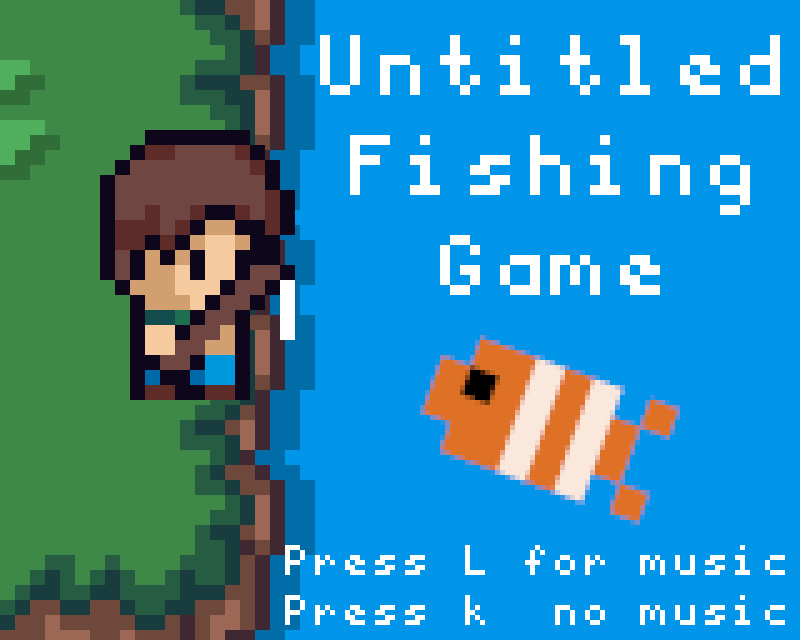

# Untitled Fishing Game (Sprig Edition)
This is a small fishing game written in C that runs on the Hack Club Sprig, a RP2040 based game console. [Demo Video](https://colinvandermeer.github.io/projects/sprigFishingDemo.mp4)

I really liked the sprig console, but I wasn't a fan of the default game engine and most of the games availible, so I decided to build my own game in a custom engine. This is designed as a small "pick up and play" game, where you can play it for a few minutes and then put it back down again.

## How to run
- Download a .uf2 binary from [releases](https://github.com/ColinVanderMeer/PicoGame/releases/latest) or compile a version yourself
- Hold the BOOTSEL button on the back of the sprig and plug it in
- Drag and drop the .uf2 file onto the RPI-RP2 drive

## Third party
- Graphics library: [hagl](https://github.com/tuupola/hagl)
- Music library: [pico-mod-player](https://github.com/moefh/pico-mod-player)
- Music: [hymn to aurora](https://modarchive.org/index.php?request=view_by_moduleid&query=99684)
- Pixel art tiles and player: [Cute Fantasy RPG](https://kenmi-art.itch.io/cute-fantasy-rpg) by [Kenmi](https://kenmi-art.itch.io/)

